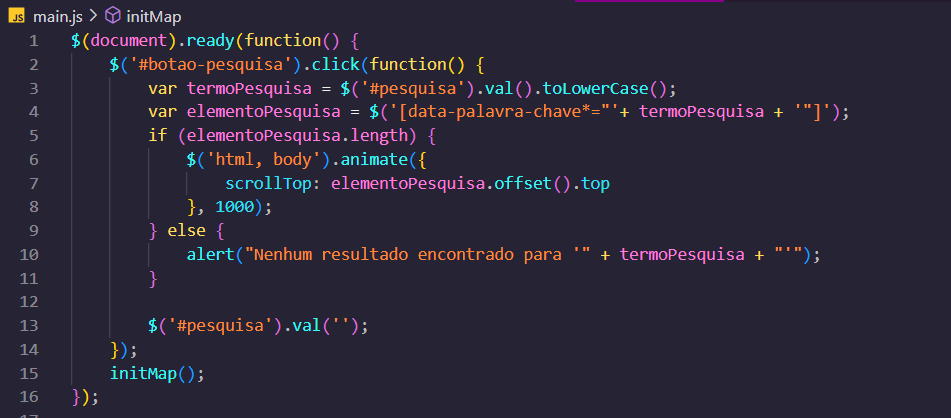
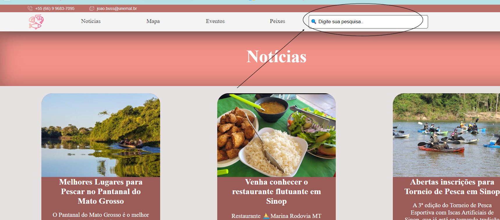
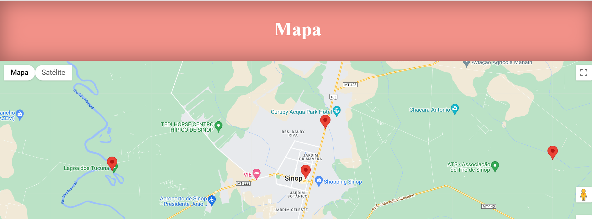
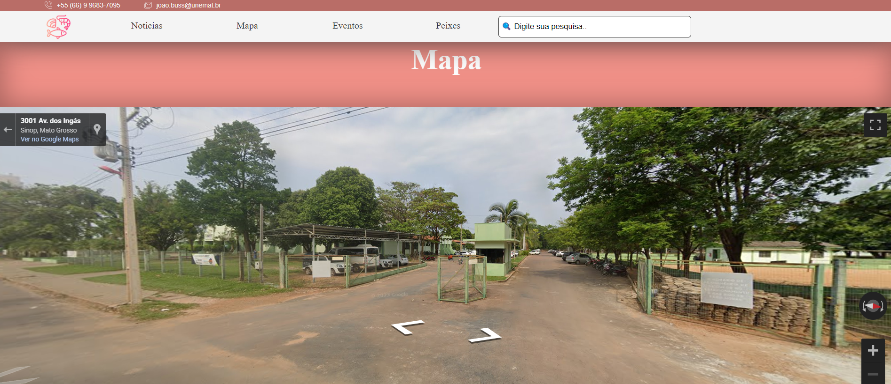
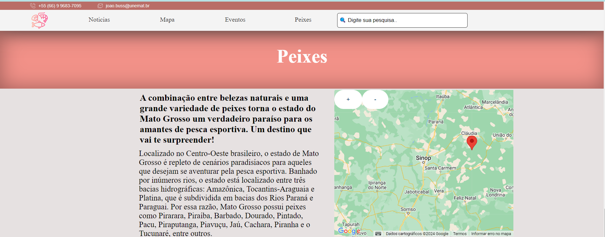
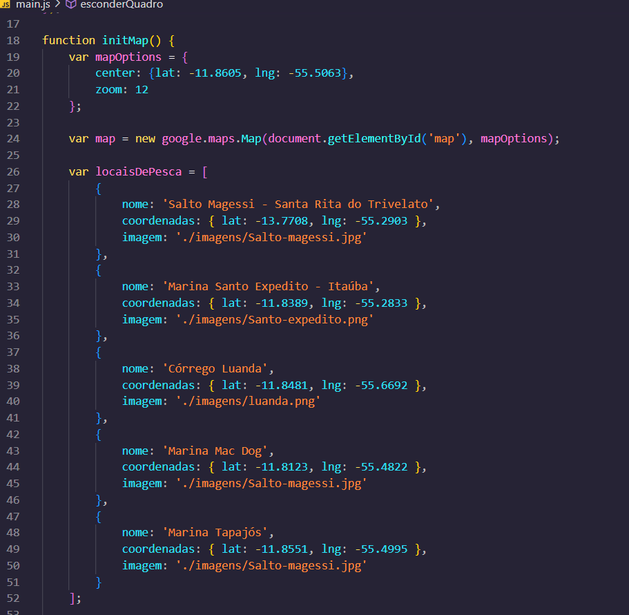
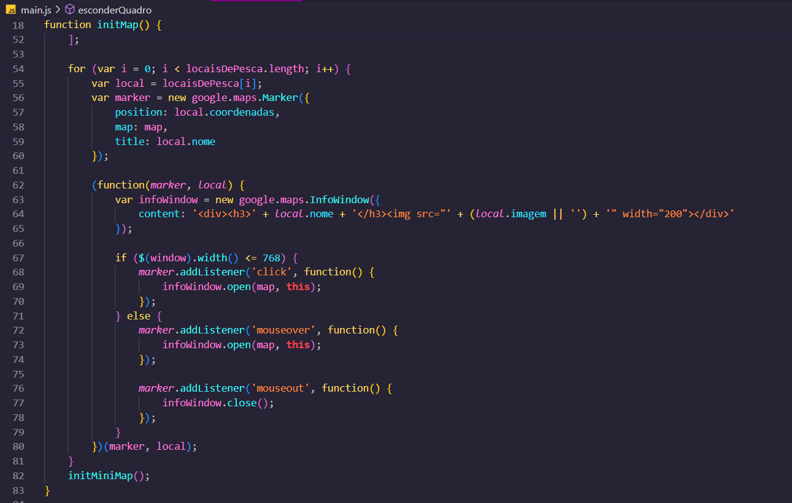
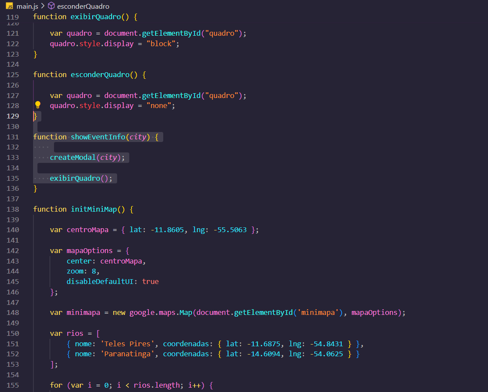
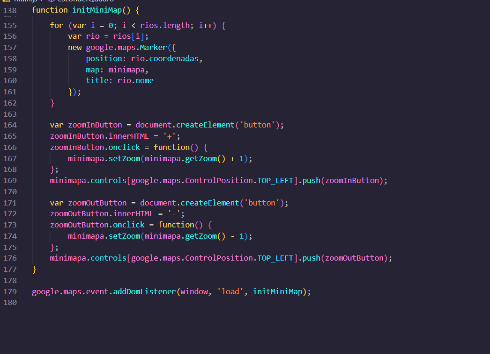

Leia-me do Blog de Pescaria
O que o blog nos oferece?
Nosso blog proporciona uma imersão completa no mundo da pescaria. Ele oferece informações valiosas sobre:

Locais de pesca: Dicas sobre os melhores lugares para pescar.
Festivais de pesca: Informações sobre eventos e festivais de pesca.
Cidades e pontos de pesca: Foco especial na região Centro-Oeste, destacando os melhores pontos e cidades para a prática da pescaria.
Estrutura do Código
O blog foi desenvolvido utilizando principalmente HTML, CSS e JavaScript. Utilizamos a API do Google Maps para exibir mapas interativos, facilitando a localização dos pontos de pesca.

Para melhorar a funcionalidade de busca no site, utilizamos jQuery, permitindo aos usuários encontrar palavras-chave específicas de forma eficiente.

Exemplo de Código jQuery
Abaixo está um exemplo de código jQuery utilizado em nosso site para implementar a funcionalidade de busca por palavras-chave:

Explicação do Código
Vamos explicar passo a passo o código jQuery apresentado:

$(document).ready(function() { ... });

Esta função assegura que o script só será executado após o carregamento completo do documento HTML.
$('#botao-pesquisa').click(function() { ... });

Define uma ação a ser executada quando o botão de pesquisa for clicado.
var termoPesquisa = $('#pesquisa').val().toLowerCase();

Captura o valor inserido pelo usuário no campo de pesquisa e o converte para letras minúsculas, garantindo que a busca não seja sensível a maiúsculas/minúsculas.
var elementoPesquisa = $('[data-palavra-chave="' + termoPesquisa + '"]');*

Seleciona todos os elementos no documento que contenham a palavra-chave inserida no atributo data-palavra-chave.
if (elementoPesquisa.length) { ... } else { ... }

Verifica se algum elemento correspondente à palavra-chave foi encontrado:
Se encontrado: Anima a rolagem da página para levar o usuário até o elemento.
Se não encontrado: Exibe um alerta informando que nenhum resultado foi encontrado para a palavra-chave inserida.
$('html, body').animate({ scrollTop: elementoPesquisa.offset().top }, 1000);

Anima a rolagem da página para o topo do elemento encontrado, ao longo de 1 segundo (1000 milissegundos).
alert("Nenhum resultado encontrado para '" + termoPesquisa + "'");

Exibe um alerta caso nenhum elemento correspondente seja encontrado.
$('#pesquisa').val('');

Limpa o campo de pesquisa após a tentativa de busca.
initMap();

Chama a função initMap, que inicializa o mapa interativo utilizando a API do Google Maps.
Este código melhora a experiência de busca no blog, permitindo aos usuários localizar rapidamente o conteúdo desejado e navegar de maneira eficiente.

Aqui esta o exemplo da onde utilizar ela no site 

##

Mapa Interativo de Pescaria
Criamos um mapa interativo utilizando JavaScript para facilitar a navegação e localização dos melhores pontos de pesca. O mapa é compacto e fácil de usar, permitindo que os usuários explorem diferentes áreas, como se estivessem usando o Google Maps online. Além disso, destacamos os locais de pesca e áreas com alta densidade de peixes.

Exemplo de Código do Mapa
Abaixo está o código JavaScript utilizado para criar o mapa interativo:

Função initMap()
A função initMap inicializa o mapa principal e adiciona marcadores para os locais de pesca:

Configuração do Mapa:
O código define o centro do mapa e o nível de zoom inicial:

var mapOptions = {
    center: {lat: -11.8605, lng: -55.5063},
    zoom: 12 
};

var map = new google.maps.Map(document.getElementById('map'), mapOptions);
Locais de Pesca:
Um array contém informações sobre os locais de pesca, incluindo nome, coordenadas e imagem:

var locaisDePesca = [
    { 
        nome: 'Salto Magessi - Santa Rita do Trivelato',
        coordenadas: { lat: -13.7708, lng: -55.2903 },
        imagem: './imagens/Salto-magessi.jpg'
    },
    {
        nome: 'Marina Santo Expedito - Itaúba',
        coordenadas: { lat: -11.8389, lng: -55.2833 },
        imagem: './imagens/Santo-expedito.png'
    },
    {
        nome: 'Córrego Luanda',
        coordenadas: { lat: -11.8481, lng: -55.6692 },
        imagem: './imagens/luanda.png'
    },
    {
        nome: 'Marina Mac Dog',
        coordenadas: { lat: -11.8123, lng: -55.4822 },
        imagem: './imagens/Salto-magessi.jpg'
    },
    {
        nome: 'Marina Tapajós',
        coordenadas: { lat: -11.8551, lng: -55.4995 },
        imagem: './imagens/Salto-magessi.jpg'
    }
];
Adicionando Marcadores:
Para cada local, um marcador é criado e adicionado ao mapa. Uma InfoWindow é configurada para exibir informações sobre o local ao clicar (em dispositivos móveis) ou ao passar o mouse (em desktops):

for (var i = 0; i < locaisDePesca.length; i++) {
    var local = locaisDePesca[i];
    var marker = new google.maps.Marker({
        position: local.coordenadas,
        map: map,
        title: local.nome
    });

    (function(marker, local) {
        var infoWindow = new google.maps.InfoWindow({
            content: '
<h3>' + local.nome + '</h3>
'
        });

        if ($(window).width() <= 768) {
            marker.addListener('click', function() {
                infoWindow.open(map, this);
            });
        } else {
            marker.addListener('mouseover', function() {
                infoWindow.open(map, this);
            });

            marker.addListener('mouseout', function() {
                infoWindow.close();
            });
        }
    })(marker, local);
}
initMiniMap();
Função createModal(city)
A função createModal cria um modal para exibir informações sobre eventos de pesca em uma cidade específica:

function createModal(city) {
    var modal = document.createElement('div');
    modal.classList.add('modal');

    var modalContent = document.createElement('div');
    modalContent.classList.add('modal-content');

    var title = document.createElement('h2');
    title.textContent = 'Evento em ' + city;
    modalContent.appendChild(title);

    var eventInfo = document.createElement('p');
    eventInfo.textContent = 'Informações sobre os eventos de pesca em ' + city;
    modalContent.appendChild(eventInfo);

    var closeButton = document.createElement('button');
    closeButton.textContent = 'Fechar';
    closeButton.addEventListener('click', function() {
        modal.remove();
    });
    modalContent.appendChild(closeButton);

    modal.appendChild(modalContent);
    document.body.appendChild(modal);
}
Cria um modal com título, informações sobre o evento e um botão para fechar o modal.
Função showEventInfo(city)
A função showEventInfo chama createModal para exibir informações sobre eventos de pesca em uma cidade e exibe um quadro adicional:

function showEventInfo(city) {
    createModal(city);
    exibirQuadro();
}
Funções exibirQuadro() e esconderQuadro()
Estas funções exibem ou escondem um quadro de informações na página:

function exibirQuadro() {
    var quadro = document.getElementById("quadro");
    quadro.style.display = "block";
}

function esconderQuadro() {
    var quadro = document.getElementById("quadro");
    quadro.style.display = "none";
}
Função initMiniMap()
A função initMiniMap inicializa um minimapa com alguns rios marcados:

Configuração do Mini Mapa:
O código define o centro do minimapa e o nível de zoom inicial:

var centroMapa = { lat: -11.8605, lng: -55.5063 };

var mapaOptions = {
    center: centroMapa,
    zoom: 8, 
    disableDefaultUI: true 
};

var minimapa = new google.maps.Map(document.getElementById('minimapa'), mapaOptions);
Rios:
Um array contém informações sobre os rios, incluindo nome e coordenadas:

var rios = [
    { nome: 'Teles Pires', coordenadas: { lat: -11.6875, lng: -54.8431 } },
    { nome: 'Paranatinga', coordenadas: { lat: -14.6094, lng: -54.0625 } }
];

for (var i = 0; i < rios.length; i++) {
    var rio = rios[i];
    new google.maps.Marker({
        position: rio.coordenadas,
        map: minimapa,
        title: rio.nome
    });
}
Botões de Zoom:
Botões de zoom são adicionados ao minimapa:

var zoomInButton = document.createElement('button');
zoomInButton.innerHTML = '+';
zoomInButton.onclick = function() {
    minimapa.setZoom(minimapa.getZoom() + 1);
};
minimapa.controls[google.maps.ControlPosition.TOP_LEFT].push(zoomInButton);

var zoomOutButton = document.createElement('button');
zoomOutButton.innerHTML = '-';
zoomOutButton.onclick = function() {
    minimapa.setZoom(minimapa.getZoom() - 1);
};
minimapa.controls[google.maps.ControlPosition.TOP_LEFT].push(zoomOutButton);
Finalmente, a função initMiniMap é chamada quando a janela é carregada:

google.maps.event.addDomListener(window, 'load', initMiniMap);

Este código cria uma experiência de usuário rica e interativa, permitindo explorar locais de pesca e visualizar informações relevantes de maneira intuitiva.

##
##

Estrutura HTML do Blog de Pescaria
A estrutura HTML do blog de pescaria foi organizada em seções distintas para facilitar a navegação e a manutenção. Abaixo, vamos detalhar a estrutura, começando pela seção do cabeçalho.

A seção do cabeçalho foi organizada para incluir informações de contato, um logo, um menu de navegação, e um campo de busca. Abaixo está a descrição detalhada dos elementos presentes nesta seção.

Estrutura do Cabeçalho (Header)

html
<section class="cabecalho">
    

        <main class="margem">
            
            <a href="#">+55 (66) 9 9683-7095</a>
            
            <a href="#">joao.buss@unemat.br</a>
        </main>
    

    

        <main class="margem">
            
            <nav class="menu">
                <ul>
                    <li><a href="#noticias">Noticias</a></li>
                    <li><a href="#maps">Mapa</a></li>
                    <li class="listar-submenu"><a href="#eventos">Eventos</a>
                        <ul>
                            <li><a onclick="showEventInfo('sinop')" href="#eventos">Sinop</a></li>
                            <li><a onclick="showEventInfo('sorriso')" href="#eventos">Sorriso</a></li>
                            <li><a onclick="showEventInfo('rondonopolis')" href="#eventos">Rondonópolis</a></li>
                        </ul>
                    </li>
                    <li><a href="#peixe">Peixes</a></li>
                </ul>
            </nav>
            

                <input id="pesquisa" type="search" placeholder="🔍 Digite sua pesquisa.." onkeydown="if (event.keyCode === 13) document.getElementById('botao-pesquisa').click()">
                <button class="pesquisar" id="botao-pesquisa">Pesquisar</button>
            

        </main>
    

</section>
Descrição dos Elementos
Seção do Cabeçalho (<section class="cabecalho">)

Define a área do cabeçalho da página.
Informações de Contato (
)

Um contêiner que exibe as informações de contato, incluindo o telefone e o e-mail.

html

    <main class="margem">
        
        <a href="#">+55 (66) 9 9683-7095</a>
        
        <a href="#">joao.buss@unemat.br</a>
    </main>

Logo e Menu de Navegação (
)

Um contêiner principal que organiza a logo, o menu de navegação e o campo de busca.

html

    <main class="margem">
        
        <nav class="menu">
            <ul>
                <li><a href="#noticias">Noticias</a></li>
                <li><a href="#maps">Mapa</a></li>
                <li class="listar-submenu"><a href="#eventos">Eventos</a>
                    <ul>
                        <li><a onclick="showEventInfo('sinop')" href="#eventos">Sinop</a></li>
                        <li><a onclick="showEventInfo('sorriso')" href="#eventos">Sorriso</a></li>
                        <li><a onclick="showEventInfo('rondonopolis')" href="#eventos">Rondonópolis</a></li>
                    </ul>
                </li>
                <li><a href="#peixe">Peixes</a></li>
            </ul>
        </nav>
        

            <input id="pesquisa" type="search" placeholder="🔍 Digite sua pesquisa.." onkeydown="if (event.keyCode === 13) document.getElementById('botao-pesquisa').click()">
            <button class="pesquisar" id="botao-pesquisa">Pesquisar</button>
        

    </main>

Logo (<a class="logo">)

Um link que contém a imagem da logo do blog.

html

Menu de Navegação (<nav class="menu">)

O menu de navegação principal com links para diferentes seções do site, incluindo um submenu para eventos.

html
<nav class="menu">
    <ul>
        <li><a href="#noticias">Noticias</a></li>
        <li><a href="#maps">Mapa</a></li>
        <li class="listar-submenu"><a href="#eventos">Eventos</a>
            <ul>
                <li><a onclick="showEventInfo('sinop')" href="#eventos">Sinop</a></li>
                <li><a onclick="showEventInfo('sorriso')" href="#eventos">Sorriso</a></li>
                <li><a onclick="showEventInfo('rondonopolis')" href="#eventos">Rondonópolis</a></li>
            </ul>
        </li>
        <li><a href="#peixe">Peixes</a></li>
    </ul>
</nav>
Campo de Busca (
)

Um campo de busca que permite aos usuários pesquisar conteúdo no site. O botão de pesquisa é acionado ao pressionar a tecla Enter.

html

    <input id="pesquisa" type="search" placeholder="🔍 Digite sua pesquisa.." onkeydown="if (event.keyCode === 13) document.getElementById('botao-pesquisa').click()">
    <button class="pesquisar" id="botao-pesquisa">Pesquisar</button>

Considerações Finais
A seção do cabeçalho do blog de pescaria foi organizada de maneira a fornecer informações essenciais de contato, uma navegação clara e um campo de busca acessível. Essa estrutura melhora a usabilidade e a experiência do usuário, permitindo fácil acesso às principais seções e funcionalidades do site.

##

Seção de Notícias
A seção de notícias é destinada a apresentar os últimos acontecimentos e informações relevantes sobre pesca, festivais e eventos na região. Ela é estruturada de forma a facilitar a leitura e o acesso rápido aos conteúdos mais recentes.

html
<section class="noticias" id="noticias" data-palavra-chave="noticias">
    <h1>Notícias</h1>
</section>
<section class="noticias">: Define uma seção específica para as notícias.
id="noticias": Um identificador único para a seção, utilizado para navegação.
data-palavra-chave="noticias": Um atributo de dados para auxiliar na pesquisa de conteúdo.
<h1>Notícias</h1>: O título da seção.

Seções de Conteúdo Informativo
A área principal do conteúdo é composta por várias seções que apresentam informações e imagens relevantes. Cada bloco informativo é dedicado a um tópico específico, com um título, uma breve descrição e um link para saber mais.

html
<main class="margem conteudo">
    <section class="outras-secoes">
        <!-- Bloco Informativo 1 -->
        <section class="bloco-informativo">
            <section class="imagem-bloco">
                
            </section>
            <h3>Melhores Lugares para Pescar no Pantanal do Mato Grosso</h3>
            
O Pantanal do Mato Grosso é o melhor e mais procurado destino para pesca no Brasil!

            <a href="https://www.visitpantanal.com/blog/melhores-lugares-para-pescar-no-pantanal-do-mato-grosso-do-sul/" target="blank"><button>Saiba mais</button></a>
        </section>
        
        <!-- Bloco Informativo 2 -->
        <section class="bloco-informativo">
            <section class="imagem-bloco">
                
            </section>
            <h3>Venha conhecer o restaurante flutuante em Sinop</h3>
            
Restaurante ⛵Marina Rodovia MT 222, km 13, Sinop-MT(sentido aeroporto de sinop, após a ponte do Rio Teles Pires) (66) 99900-0099 (66) 99900-2004.

            <a href="https://www.instagram.com/restauranteemarinatapajos/"><button>Saiba mais</button></a>
        </section>

        <!-- Bloco Informativo 3 -->
        <section class="bloco-informativo">
            <section class="imagem-bloco">
                
            </section>
            <h3>Abertas inscrições para Torneio de Pesca em Sinop</h3>
            
A 3ª edição do Torneio de Pesca Esportiva com Iscas Artificiais de Sinop, que já está se tornando tradição e atraindo pescadores de todo Estado, está com as inscrições abertas e podem ser feitas online, clicando no https://sistema.sinop.mt.gov.br/ 

            <a href="https://www.diariodoestadomt.com.br/noticias/abertasinscri-c-iesparatorneiodepescaemsinop/82029200"><button>Saiba mais</button></a>
        </section>

        <!-- Bloco Informativo 4 -->
        <section class="bloco-informativo">
            <section class="imagem-bloco">
                
            </section>
            <h3>Torneio de pesca com premiação de até R$ 100 mil é realizado neste domingo (3) em MT</h3>
            
A competição está marcada para às 8h, na Praia do Cortado. Cerca de 400 pescadores se inscreveram e vão participar do evento. 

            <a href="https://g1.globo.com/mt/mato-grosso/noticia/2023/09/02/torneio-de-pesca-com-premiacao-de-ate-r-100-mil-e-realizado-neste-domingo-3-em-mt.ghtml"><button>Saiba mais</button></a>
        </section>

        <!-- Bloco Informativo 5 -->
        <section class="bloco-informativo">
            <section class="imagem-bloco">
                
            </section>
            <h3>Torneio de pesca em Itaúba</h3>
            
Veja como foi o torneio realizado.

            <a href="https://www.itauba.mt.gov.br/Imprensa/Galeria-de-Fotos/Festival-de-pesca-76"><button>Saiba mais</button></a>
        </section>

        <!-- Bloco Informativo 6 -->
        <section class="bloco-informativo">
            <section class="imagem-bloco">
                
            </section>
            <h3>Sorriso: Festival de Pesca</h3>
            
É considerado um dos maiores de MT e contará com shows de Breno Reis e Marco Viola e Gabriel Marcolan.

            <a href="https://www.jknoticias.com/portal/2023/09/12/sorriso-festival-de-pesca-e-considerado-um-dos-maiores-de-mt-e-contara-com-shows-de-breno-reis-e-marco-viola-e-gabriel-marcolan/"><button>Saiba mais</button></a>
        </section>
    </section>
</main>

Descrição dos Elementos de Cada Bloco Informativo
<section class="bloco-informativo">: Define um bloco de conteúdo informativo.
<section class="imagem-bloco">: Contém a imagem relacionada ao conteúdo do bloco.
: A imagem associada ao conteúdo, com uma descrição alternativa para acessibilidade.
<h3>{Título}</h3>: O título do bloco, descrevendo brevemente o assunto.

{Descrição}
: Uma breve descrição ou resumo do conteúdo do bloco.
<a href="{link}" target="blank"><button>Saiba mais</button></a>: Um link para mais informações, encapsulado em um botão que abre em uma nova aba.

Considerações Finais
Essa estrutura modular permite uma apresentação clara e organizada das informações, facilitando a navegação e a leitura. Cada bloco informativo é projetado para ser visualmente atraente e funcional, proporcionando aos usuários acesso rápido e fácil às informações mais relevantes sobre pesca, eventos e locais de interesse na região.

##

Seção do Mapa
A seção do mapa é projetada para fornecer uma visão interativa dos pontos de pesca, eventos e outras localizações relevantes para os usuários do blog. Esta seção utiliza o Google Maps para criar uma experiência imersiva e intuitiva.

Estrutura HTML da Seção do Mapa

html
<section class="maps" id="maps" data-palavra-chave="mapa">
    <h1>Mapa</h1>
</section>

<section class="maps" id="maps" data-palavra-chave="mapa">: Define uma seção dedicada ao mapa.

class="maps": Especifica a classe CSS para estilização.
id="maps": Um identificador único para a seção, utilizado para navegação e ligação de ancoragem.
data-palavra-chave="mapa": Um atributo de dados que ajuda na funcionalidade de pesquisa de palavras-chave.
<h1>Mapa</h1>: O título da seção, informando os usuários sobre o conteúdo da seção.

: Um contêiner div para o mapa do Google Maps.

id="map": Um identificador único para o elemento do mapa, usado para inicializar o Google Maps via JavaScript.
style="height: 500px;": Define a altura do mapa em pixels, garantindo que o mapa ocupe um espaço visível e interativo na página.
JavaScript de Inicialização do Google Maps
Para que o mapa funcione corretamente, é necessário um código JavaScript que inicialize o Google Maps, defina suas opções e adicione marcadores interativos.

javascript
function initMap() {
    var mapOptions = {
        center: {lat: -11.8605, lng: -55.5063}, // Centro do mapa
        zoom: 12 // Nível de zoom inicial
    };

    // Criação do mapa dentro do elemento com ID 'map'
    var map = new google.maps.Map(document.getElementById('map'), mapOptions);

    // Definição dos locais de pesca com coordenadas e informações adicionais
    var locaisDePesca = [
        {
            nome: 'Salto Magessi - Santa Rita do Trivelato',
            coordenadas: { lat: -13.7708, lng: -55.2903 },
            imagem: './imagens/Salto-magessi.jpg'
        },
        {
            nome: 'Marina Santo Expedito - Itaúba',
            coordenadas: { lat: -11.8389, lng: -55.2833 },
            imagem: './imagens/Santo-expedito.png'
        },
        {
            nome: 'Córrego Luanda',
            coordenadas: { lat: -11.8481, lng: -55.6692 },
            imagem: './imagens/luanda.png'
        },
        {
            nome: 'Marina Mac Dog',
            coordenadas: { lat: -11.8123, lng: -55.4822 },
            imagem: './imagens/Salto-magessi.jpg'
        },
        {
            nome: 'Marina Tapajós',
            coordenadas: { lat: -11.8551, lng: -55.4995 },
            imagem: './imagens/Salto-magessi.jpg'
        }
    ];

    // Adição de marcadores para cada local de pesca
    locaisDePesca.forEach(function(local) {
        var marker = new google.maps.Marker({
            position: local.coordenadas,
            map: map,
            title: local.nome
        });

        var infoWindow = new google.maps.InfoWindow({
            content: '
<h3>' + local.nome + '</h3>
'
        });

        if ($(window).width() <= 768) {
            // Exibe a infoWindow ao clicar no marcador para telas menores
            marker.addListener('click', function() {
                infoWindow.open(map, marker);
            });
        } else {
            // Exibe a infoWindow ao passar o mouse sobre o marcador para telas maiores
            marker.addListener('mouseover', function() {
                infoWindow.open(map, marker);
            });

            // Fecha a infoWindow ao retirar o mouse do marcador
            marker.addListener('mouseout', function() {
                infoWindow.close();
            });
        }
    });
    
    initMiniMap(); // Inicializa um mini mapa adicional, se necessário
}

// Função para inicializar um mini mapa
function initMiniMap() {
    var centroMapa = { lat: -11.8605, lng: -55.5063 };

    var mapaOptions = {
        center: centroMapa,
        zoom: 8,
        disableDefaultUI: true
    };

    var minimapa = new google.maps.Map(document.getElementById('minimapa'), mapaOptions);

    var rios = [
        { nome: 'Teles Pires', coordenadas: { lat: -11.6875, lng: -54.8431 } },
        { nome: 'Paranatinga', coordenadas: { lat: -14.6094, lng: -54.0625 } }
    ];

    rios.forEach(function(rio) {
        new google.maps.Marker({
            position: rio.coordenadas,
            map: minimapa,
            title: rio.nome
        });
    });

    // Botões de zoom in e zoom out para o mini mapa
    var zoomInButton = document.createElement('button');
    zoomInButton.innerHTML = '+';
    zoomInButton.onclick = function() {
        minimapa.setZoom(minimapa.getZoom() + 1);
    };
    minimapa.controls[google.maps.ControlPosition.TOP_LEFT].push(zoomInButton);

    var zoomOutButton = document.createElement('button');
    zoomOutButton.innerHTML = '-';
    zoomOutButton.onclick = function() {
        minimapa.setZoom(minimapa.getZoom() - 1);
    };
    minimapa.controls[google.maps.ControlPosition.TOP_LEFT].push(zoomOutButton);
}

google.maps.event.addDomListener(window, 'load', initMap);
Descrição do JavaScript
var mapOptions = {...};: Define as opções iniciais do mapa, como o centro e o nível de zoom.
var map = new google.maps.Map(...);: Cria um novo mapa dentro do elemento div com ID map.
var locaisDePesca = [...];: Lista de locais de pesca com suas coordenadas, nomes e imagens.
locaisDePesca.forEach(function(local) {...});: Adiciona um marcador no mapa para cada local de pesca.
var infoWindow = new google.maps.InfoWindow({...});: Cria uma janela de informações para cada marcador.
marker.addListener('click', function() {...});: Adiciona um evento de clique para exibir a janela de informações em dispositivos móveis.
marker.addListener('mouseover', function() {...});: Adiciona um evento de mouseover para exibir a janela de informações em desktops.
initMiniMap();: Chama a função para inicializar um mini mapa adicional.
google.maps.event.addDomListener(window, 'load', initMap);: Carrega o mapa quando a janela é carregada.

Conclusão
A integração de um mapa interativo com marcadores detalhados melhora significativamente a experiência do usuário, permitindo explorar locais de pesca e eventos de forma visual e intuitiva. Essa abordagem oferece uma ferramenta valiosa para os pescadores e entusiastas, facilitando a localização de pontos de interesse e o planejamento de suas atividades.